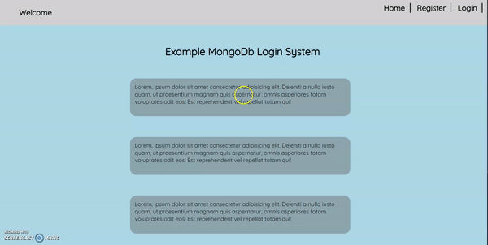

# Login System with Mongo DB and Express

## An example MongoDB database and login system using node express js, handlebars and middleware cookies authentication.

- A Mongo DB collection is created inisde the models folder called users

- Users can register with a name, email and password; only if the email isn't taken in the database. 

- app.post sends the user data to the mongo database 

- if the user enters the wrong email or password when logging in, user is redirected back to the 

- Once logged in users can update their details and log back in 

- Users not logged in cannot access the profile or welcome pages. This is achived using authentication middleware 

- alex@email.com is a admin users so  when logged in the admin can update all users information 

- Launches with `npm start`

## Register 

